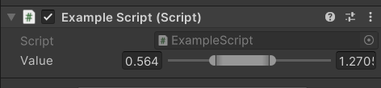

# Unity-Attribute-MinMax-Slider

The main goal was to create the simplest and most user-friendly script that would allow adding the Range Slider attribute to common Unity scripts for easy configuration in the editor. 
This Unity utility provides a custom attribute MinMaxSliderAttribute and its corresponding PropertyDrawer MinMaxSliderDrawer, designed for use in the Unity Editor. It allows developers to easily create a user-friendly slider in the Unity Inspector for setting minimum and maximum float values within a defined range. This tool is particularly useful for controlling ranges of values within your Unity projects, such as spawning frequencies, movement boundaries, or any scenario where a minimum and maximum value is required.

## Features
 - Custom Slider for Vector2: Utilize a slider in the Unity Inspector to define a range between minimum and maximum values. 
 - Easy to Use: Simply add the **[MinMaxSlider(min, max)]** attribute to a Vector2 field in your script to create a min/max slider in the Inspector. 
 - Flexible Range Setting: Define the minimum and maximum values of the slider directly through the attribute.
   
## Requirements
 - Unity 2022 or newer.
 - This utility is intended for use with C# scripts in Unity.
## Installation
To use the MinMaxSliderAttribute and MinMaxSliderDrawer in your project, follow these steps:
 - Download: Clone this repository or download the provided C# scripts directly.
 - Import: Copy the scripts into your Unity project's Scripts folder, or any subfolder within Assets.
 - Implement: Attach the scripts to any Unity GameObject or create a new script to utilize the attribute.
### Usage
After installation, you can use the attribute in your scripts like so:

```C#
using UnityEngine;

public class ExampleUsage : MonoBehaviour
{
    [MinMaxSlider(0, 100)]
    public Vector2 spawnRange;

    void Start()
    {
        Debug.Log($"Spawn Range: {spawnRange.x} to {spawnRange.y}");
    }
}
```
- **Attributes**: MinMaxSlider(float min, float max) - Apply this attribute to a Vector2 field in your script. The **x** component represents the minimum value, and the **y** component represents the maximum value of the slider.
- **Inspector**: The specified Vector2 field will display a slider in the Unity Inspector, allowing for easy adjustment of minimum and maximum values within the specified range.
### Customization
The MinMaxSliderDrawer script includes several settings for customizing the appearance and behavior of the sliders in the Unity Inspector, such as label width, field width, and slider width. These can be adjusted to fit the layout of your custom Inspector designs.

### Compatibility
This utility is compatible with Unity 2022 and newer versions. It is specifically designed to work within the Unity Editor and requires the UnityEditor namespace.

### License
This project is available under the MIT license. Feel free to use, modify, and distribute it as per your needs.
